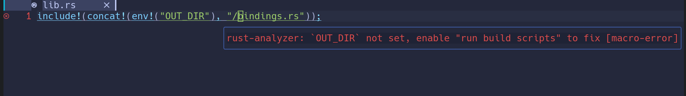

Reproduces the bug described in [Regression in v0.2.686: OUT_DIR not set, enable "run build scripts" to fix](https://github.com/rust-analyzer/rust-analyzer/issues/9720).

rust-analyzer version: rust-analyzer 516eb40ba 2021-09-13 stable

Screenshot (neovim):

